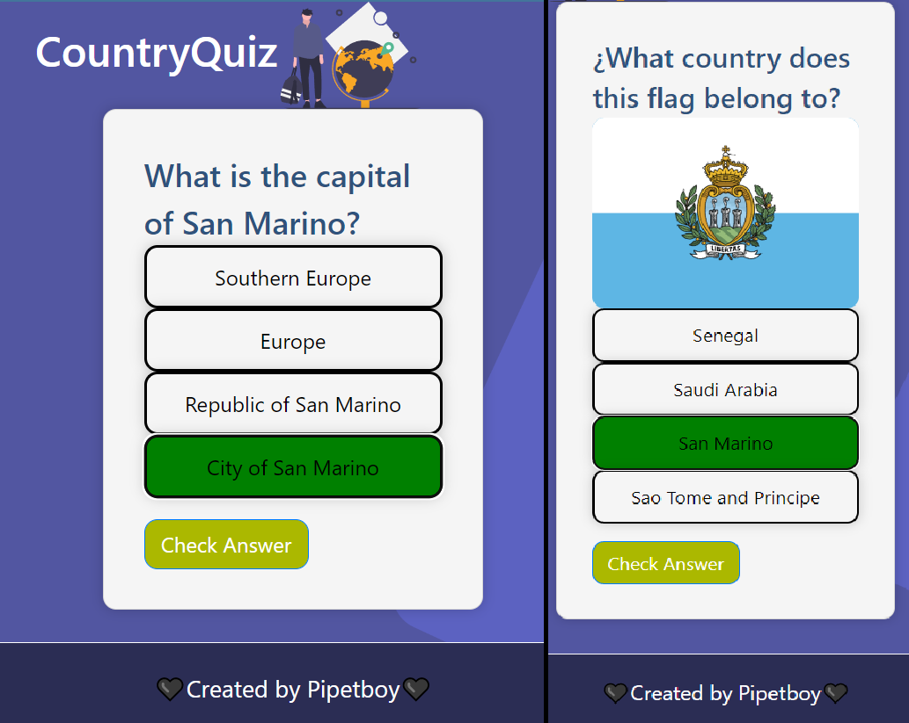

<div align="center">
      <h1> <br/>Country Quiz </h1></div>

<div align="center">
   solución para el  challenge de un quiz de paises que pregunta por la bandera y la capital <a href="http://devchallenges.io" target="_blank">Devchallenges.io</a>.
</div>

## Descripción

<div align="center">
  <h3>
    <a href="https://quiz-pipetboy.vercel.app/">
      Demo
    </a>
    <span> | </span>
    <a href="https://devchallenges.io/challenges/Bu3G2irnaXmfwQ8sZkw8">
      Challenge
    </a>
  </h3>
</div>




### Built With
     
      

## Características

[x]  Existencia de 2 tipos de preguntas
[x]  Puedes seleccionar una respuesta 
[x]  Puedes ver si la respuesta es correcta o incorrecta 
[x]  Puedes seguir si has contestado a una nueva pregunta
[x]  Puedes ver si te has equivocado seleccionado
[x]  Puedes ver tu puntuación al final del juego y volver a intentar


## Como Instalar de manera Local
Para clonar y ejecutar esta aplicación, necesitará [Git](https://git-scm.com) y [Node.js](https://nodejs.org/en/download/) (que viene con [ npm](http://npmjs.com)) instalado en su computadora. Desde su línea de comando:

```bash
# Clone this repository
$ git clone https://github.com/pipetboy2001/Country-quiz

# Install dependencies
$ npm install

# Run the app
$ npm start
```
## Mi experencia en este challange
Nuevamente otro desafio donde tuve que buscar por mi cuenta otra API que hiciera algo similar a la que me entregban en este caso entregaban la API de https://restcountries.eu/ , la cual no esta disponible por lo que buscando encontre https://restcountries.com/v2/all que investigando es solo un error de devchallenges al no colocar la API correcta 
Por otro lado este desafio tuvo mas complicaciones pero a la vez ayudo mucho el realizar el [Proyecto de botones](https://github.com/pipetboy2001/Boton-Generador) ,ya que aqui hice un boton para que cambiara de color segun si era la respuesta correcta o no lo es ,lo cual es algo ya hecho anteriormente de esta pila de desafios